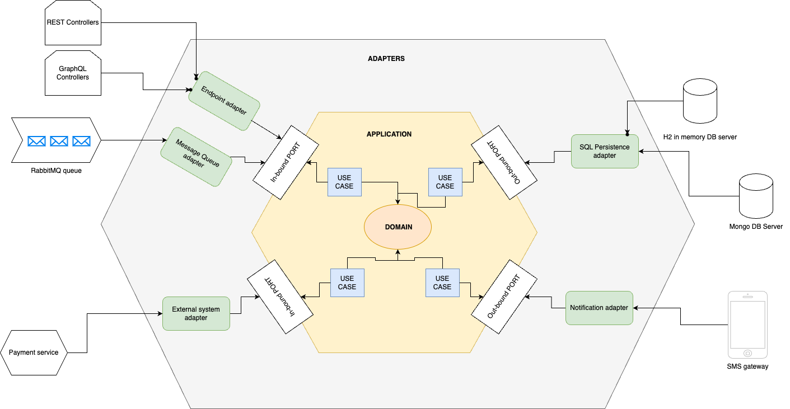

# Hexagonal [Ports and Adapters] Architecture Spring Boot 

A Spring Boot template implementing the Hexagonal Architecture pattern (also known as Ports and Adapters).

- **Framework-agnostic at its core**: Business logic is independent of external frameworks.
- **Modular and maintainable**: Clear separation between core domain, application logic, and infrastructure.

## General Hexagonal diagram


## Actual Hexagonal/Ports and adapters architecture diagram




## Overview

This project structure follows the hexagonal architecture pattern, organized into three main layers:

```
src/main/java/com/example/
├──application/
│  ├── port/
│  │   ├── in/                         # Input ports (use cases the application offers)
│  │   │   ├── api/                    # Interfaces consumed by driving adapters
│  │   │   └── external/               # Interfaces through we are called by other services to call our service
│  │   ├── out/                        # Output ports (services the application needs)
│  │   │   ├── persistence/            # persistence interfaces for data source
│  │   │   ├── external/               # Interfaces through we call External services
│  │   │   └── Messaging/              # Interfaces for emitting msgs/streams
│  │   ├── service/
│  │   │   └── impl/                   # Implementations of use cases
│  │   └── usecase/
│  │       └──                         # List of use cases of the service (element of analysys of usecase UML diagrams)
├──domain/
│  ├── model/                          # Business models
│  ├── exception/                      # Domain-specific exceptions
├──infrastructure/
│  ├── adapter/
│  │    ├── in/                        # Incoming adapters (API controllers, event listeners)
│  │    │   ├── impl/                  # Implementation of the Incoming port interfaces (such as api..etc)
│  │    │   ├── rest/                  # REST controllers will use the the endpoint adapters
│  │    │   ├── graphql                # GraphQL controllers 
│  │    │   ├── event/                 # Event listeners (e.g., for message queues)
│  │    │   └── security/              # Security layer (Authentication, Authorization)
│  │    ├── out/                       # Outgoing adapters (external systems like DB, messaging)
│  │    │   ├── persistence/           # Persistence layer (e.g., database interactions)
│  │    │   ├── messaging/             # Messaging layer (e.g., for external messaging systems)
│  │    │   └── externalApi/           # External APIs (e.g., third-party services)
│  ├── config/                         # Configuration files for the application setup

```

## Architecture Breakdown

### 1. **Domain Layer (**``**)**

This layer contains **pure business logic** and is completely independent of frameworks.

-  Business entities (core objects that represent the domain)
-  Custom exceptions related to the domain

### 2. **Application Layer (**``**)**

This is where business rules and application logic reside.

-   Defines input ports (use cases) consumed by controllers and event handlers.
-   Defines output ports that interact with external dependencies (database, APIs, etc.).
-   Implements use cases by orchestrating domain logic.
-  for the service package :
   - Reason:
      - Separation of concerns: The application/service/impl package is where the core business logic should reside.
      - Adherence to Hexagonal Architecture: The service/impl classes implement the interfaces defined in port/in, orchestrating the application logic and interacting with the domain models.

### 3. **Infrastructure Layer (**``**)**

This layer bridges the application with external technologies.

- **Adapters**
   - **Inbound (**``**)** → Implements input ports via controllers (e.g., REST, GraphQL, Event listeners).
   - **Outbound (**``**)** → Implements output ports via persistence (JPA, MongoDB) and external services (REST clients, Kafka producers).
   -   Centralized Spring Boot configurations (e.g., database, security, API clients).


## Key Principles

1. **Dependency Rule**: Dependencies always point inward (infrastructure → application → domain)

2. **Port Interfaces**: All interactions cross boundaries through well-defined ports
    - Input ports: Use cases offered by the application
    - Output ports: External services required by the application

3. **Adapter Implementations**: Concrete implementations of the ports
    - Inbound adapters: Implement or use input ports (e.g., REST controllers)
    - Outbound adapters: Implement output ports (e.g., database repositories)

4. **Core Isolation**: Domain logic remains isolated from external concerns, making it easier to test and less vulnerable to external changes

## Benefits

- Clear separation of concerns
- Components can be developed and tested in isolation
- Business logic is protected from external changes
- Adapters can be swapped without affecting the core
- Improved testability with cleaner unit tests

## Nota bene

1. Naming Conventions and Consistency
   make sure all names are as clear as possible to avoid ambiguity. For example:
   application/port/: It would be clearer if the directory name reflects the nature of the ports more directly, like application/adapter/ (to emphasize the distinction between inbound/outbound) or application/contract/ for clearer contract boundaries. current is acceptable
   in/ and out/: they work. Also could use "driven" or "driving" adapters

2. Service Layer Placement
   The service/impl/ directory under application/ is where implementation logic should reside. While this works well for organizing services, we need to ensure that the domain logic (business rules) remains in the domain layer, keeping the service layer strictly for coordinating use cases.

3. Persistence Layer
   infrastructure/adapter/out/persistence/:  using a clean separation for persistence. we add repository/impl/ for actual JPA repository implementations when we expect more than one type of persistence approach (e.g., NoSQL).

4. External APIs and Clients
   infrastructure/adapter/out/external/: It's great that you're separating external APIs into their own adapter layer. Be sure to avoid mixing external service logic with core business logic in this layer.

5. Exception Handling
   domain/exception/: This directory is for domain-specific exceptions. However, the way exceptions are handled between layers should be consistent. Ensure exceptions thrown by the domain are properly translated to something suitable for the service or infrastructure layer (e.g., validation errors, business rule violations).
   If you're using custom exceptions, it may help to categorize them based on the layer or purpose (e.g., validation, persistence, integration).

**Potential Enhancements or Considerations**
- Integration Tests:  placing integration tests for ports/adapters under a different package (e.g., src/test/integration/) to make it clear these tests will span across layers.
- Use of Annotations: If your application grows, consider using custom annotations for your layers, like @Service, @Port, @Adapter to enforce clear boundaries and improve readability.
- Event-Driven Approach: If you anticipate scaling to a more event-driven architecture, consider making event-related adapters a more prominent part of the structure, separating domain and application events.
